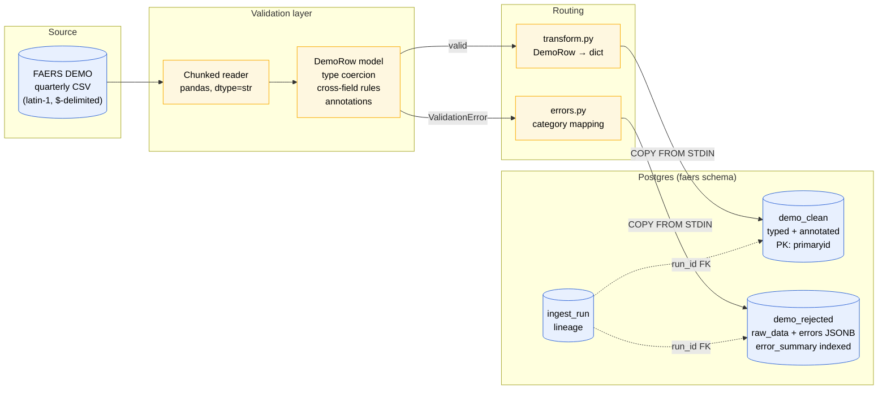

# Architecture

## Component responsibilities

| Component | File | Responsibility |
|---|---|---|
| Reader | `ingest/reader.py` | Stream rows from CSV; never load the whole file |
| Validator | `models.py`, `partial_date.py`, `enums.py` | Type coercion, range checks, cross-field rules, annotations |
| Error summariser | `ingest/errors.py` | Map Pydantic errors to a small set of queryable categories |
| Transform | `ingest/transform.py` | Convert validated row → dict for COPY |
| Pipeline | `ingest/pipeline.py` | Orchestrate the flow; manage ingest_run lifecycle |
| Storage | `db/tables.py`, Alembic migrations | Schema in code, versioned |

## Data flow

1. CLI invokes `ingest_demo_file(engine, csv_path, quarter, …)`
2. An `ingest_run` row is created with status `running`
3. CSV is streamed row-by-row through `iter_demo_records`
4. Each row is validated by `DemoRow.model_validate`
   - On success: transformed to dict, appended to clean batch
   - On `ValidationError`: appended to rejected batch with error category
5. Every `batch_size` rows, the batch is flushed via Postgres `COPY ... FROM STDIN`
   - If `--upsert`, clean rows go through a temp staging table and `INSERT ... ON CONFLICT DO UPDATE`
6. After all rows are processed, the `ingest_run` is marked `succeeded`
7. On any exception, the `ingest_run` is marked `failed` with the error message

## Validation strategy

The validator uses *graded severity*:

- **Hard reject** — single-field range violations (`weight_kg > 1000`) and catastrophic cross-field mismatches (an age that's >5× outside the declared age group). These rows go to `demo_rejected`.
- **Soft annotation** — boundary-case mismatches (a 12-year-old declared "Adolescent" when the strict band is 13–17) and suspected imputed dates (event dates ending in `0101`). These rows go to `demo_clean` with a boolean annotation column set.

The distinction matters because a 230-year-old (catastrophic) and a 12-year-old Adolescent (boundary) are *different kinds* of error. Single-tier validators conflate them; this validator doesn't.

## Why COPY, not ORM inserts

Initial implementation used `Session.add_all`, which produced ~138s of database time for 397k rows. Investigation found SQLAlchemy was falling back to `executemany` (one INSERT per row) instead of the documented `insertmanyvalues` fast path, for reasons specific to this table's column shape. After establishing the theoretical floor (4.5s for pure-Postgres `INSERT ... SELECT FROM generate_series`), we switched to Postgres `COPY ... FROM STDIN` via `psycopg.cursor.copy()`. Flush time dropped to ~6s, near the floor.